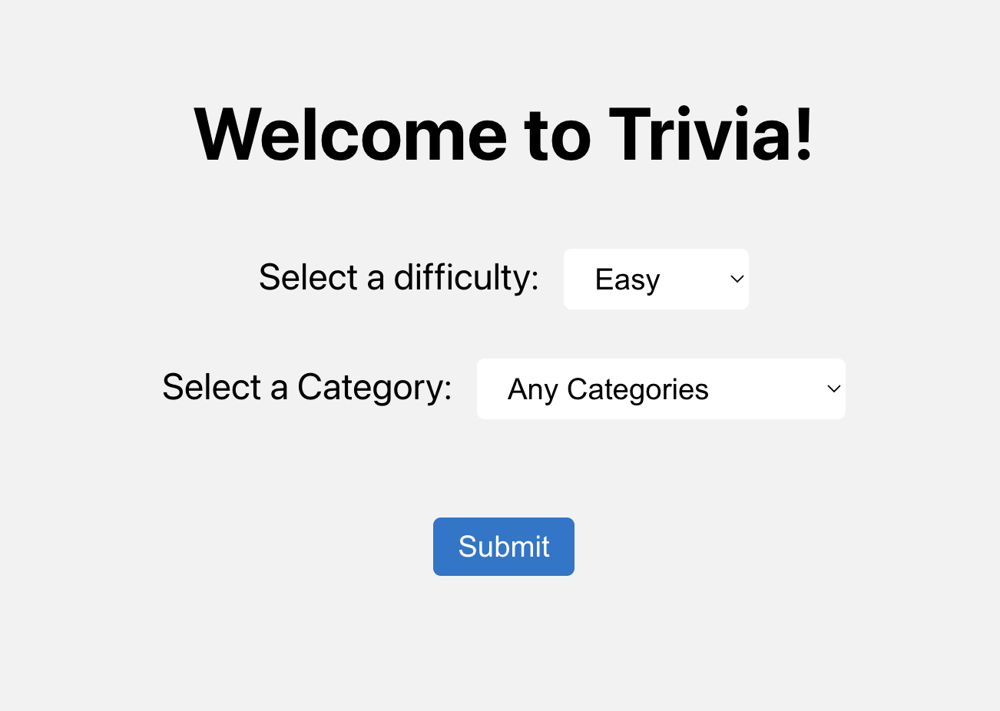

# Trivia Fun!
This is the front-end repo for the trivia fun game. Check out the back-end repo [here](https://github.com/ross-ian28/trivia-be) 

## About this project
A basic trivia game where you can choose the difficulty level and category of your questions. You'll be asked 10 questions from the selected category and your total will be added up at the end.

## Deployment
Deployed site [here](https://trivia-ross-ian28.vercel.app/)

## SetUp for Local
1. Fork this Repo
2. Clone it down to your machine
3. `cd` into the root of the project directory
4. Run `npm install` to install dependencies  
5. Run `npm start` to run your server
6. (Make sure both front-end and back-end servers are running at the same time)

## Features
*Start a Quiz*

*Answer a Question*

*Get Quiz Results*

